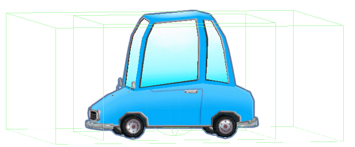
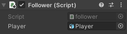

In the Inspector window for the GameObject, click ‘Add Component’ and choose CharacterController. Position and size the controller so it is above the floor and covers the whole of your follower GameObject.

**Tip:** Press ‘shift’ + ‘f’ to focus on the follower GameObject in the Scene view .

Click on ‘Add Component’ and add a Box Collider. Adjust the Center Y and Size Y values so that the collider is above the floor and covers the whole of your follower GameObject so that other characters cannot walk through or climb on top of the follower GameObject:

Go to the ‘Add Component’ button  again and add a second ‘Box Collider’ to the follower GameObject.

For this Box collider, ‘IsTrigger’ to make the follower GameObject move if the Player gets close enough to draw the followers attention. This Box collider needs to be big enough that the Player can’t easily sneak past:

**Tip:** You will also need to add Box Colliders to the any other GameObjects that could move into the patrol area. These Box Colliders will not have 'Is Trigger' checked.

Click on ‘Add Component’ and add a ‘New script’ then give your script a sensible name. Double-click on your new script to open it in the code editor.

Create variables to store whether or not the follower GameObject is following the Player, set the speed and distance and set the direction position:

--- code ---
---
language: cs
---
    bool isFollowing = false;
    float followSpeed = 3f;
    float followDistance = 4f;
    Vector3 moveDirection = Vector3.zero;
    public GameObject Player;
--- /code ---

Create an `OnTriggerEnter()` method to change the state of the variable if the Player gets close enough to collide with the trigger:

--- code ---
---
language: cs
---
    void OnTriggerEnter(Collider other)
    {
        if (other.CompareTag("Player"))
        {
            isFollowing = true;
        }
    }
--- /code ---

Add code to the `Update()` method to look at and move towards the Player if the follow state is true: 

--- code ---
---
language: cs
---
    void Update()
    {
        if (isFollowing)
        {
            transform.LookAt(Player.transform);

            if (Vector3.Distance(Player.transform.position, transform.position) > followDistance)
            {
                CharacterController controller = GetComponent<CharacterController>();
                var moveDirection = Vector3.Normalize(Player.transform.position - transform.position);
                controller.SimpleMove(moveDirection * followSpeed);
            }
        }
    }
--- /code ---

Save your code and return to the Unity editor. go to the script component in the Inspector window for the follower GameObject and click on the circle next to ‘Player’ and select the Player GameObject from the menu.

