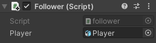

Dans la fenêtre Inspector du GameObject, clique sur **Add Component** et choisis **Character Controller**. Positionne et dimensionne le contrôleur de façon à ce qu'il soit au-dessus du sol et qu'il couvre l'ensemble de ton GameObject suiveur.

**Astuce :** appuie sur <kbd>Shift</kbd>+<kbd>F</kbd> pour centrer la vue sur le GameObject patrouilleur dans la vue Scene.

Clique sur **Add Component** et ajoute un **Box Collider**. Ajuste les valeurs Center y et Size y de façon à ce que le collider soit au-dessus du sol et couvre la totalité de ton GameObject suiveur, de sorte que les autres personnages ne puissent pas passer à travers ou grimper dessus :

Va de nouveau sur le bouton **Add Component** et ajoute un deuxième **Box Collider** au GameObject suiveur.

Pour ce Box Collider, coche la case « IsTrigger » pour que le GameObject suiveur se déplace si le joueur s'approche suffisamment pour attirer l'attention du suiveur. Ce Box Collider doit être suffisamment grand pour que le joueur ne puisse pas se faufiler facilement :

**Astuce :** tu devras également ajouter des Box Colliders à tous les autres GameObjects qui pourraient se déplacer dans la zone de patrouille. La case « IsTrigger » n'est pas cochée pour ces Box Colliders.

Clique sur **Add Component** et ajoute un **New script**, puis donne un nom judicieux à ton script. Double-clique sur ton nouveau script pour l'ouvrir dans l'éditeur de code.

Crée des variables pour stocker si le suiveur GameObject suit ou non le joueur, définit la vitesse et la distance et définit la position de direction :

--- code ---
---
language: cs
---

    bool isFollowing = false;
    float followSpeed = 3f;
    float followDistance = 4f;
    Vector3 moveDirection = Vector3.zero;
    public GameObject Player;
--- /code ---

Crée une méthode `OnTriggerEnter()` pour changer l'état de la variable si le joueur s'approche suffisamment pour entrer en collision avec le trigger :

--- code ---
---
language: cs
---

    void OnTriggerEnter(Collider other)
    {
        if (other.CompareTag("Player"))
        {
            isFollowing = true;
        }
    }
--- /code ---

Ajoute du code à la méthode `Update()` pour regarder et se déplacer vers le joueur si l'état de suivi est vrai :

--- code ---
---
language: cs
---

    void Update()
    {
        if (isFollowing)
        {
            transform.LookAt(Player.transform);
    
            if (Vector3.Distance(Player.transform.position, transform.position) > followDistance)
            {
                CharacterController controller = GetComponent<CharacterController>();
                var moveDirection = Vector3.Normalize(Player.transform.position - transform.position);
                controller.SimpleMove(moveDirection * followSpeed);
            }
        }
    }
--- /code ---

Enregistre ton code et retourne à l'éditeur Unity. Va dans le composant Script de la fenêtre Inspector pour le GameObject suiveur et clique sur le cercle à côté de « Player » et sélectionne le GameObject Player dans le menu.

