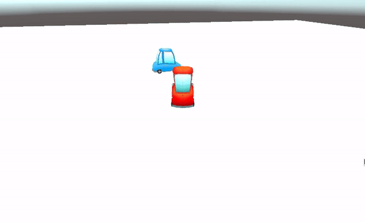

Klik in het venster Inspector voor het GameObject op **Add Component** en kies **Character Controller**. Plaats en bepaal de grootte van de controller zodat deze boven de vloer is en het hele spelobject van je volger bedekt.

**Tip:** Druk op <kbd>Shift</kbd>+<kbd>f</kbd> om scherp te stellen op het GameObject dat volgt in de Scèneweergave.

Klik op **Add Component** en voeg een **Box Collider** toe. Pas de waarden Center y en Size y zo aan dat de collider boven de vloer ligt en het hele spelobject van je volger bedekt, zodat andere personages er niet doorheen kunnen lopen of er bovenop kunnen klimmen:

Ga opnieuw naar de knop **Add Component** en voeg een tweede **Box Collider** toe aan het volger GameObject.

Voor deze Box Collider vink je 'IsTrigger' aan om het GameObject van de volger te laten bewegen als de speler dichtbij genoeg komt om de aandacht van de volger te trekken. Deze Box Collider moet groot genoeg zijn om de speler niet gemakkelijk voorbij te laten sluipen:

**Tip:** Je moet ook Box Colliders toevoegen aan alle andere GameObjects die naar het patrouillegebied kunnen bewegen. Bij deze Box Colliders is 'IsTrigger' niet aangevinkt.

Klik op **Add Component** en voeg een **New script** toe, geef vervolgens je script een logische naam. Dubbelklik op het nieuwe script om het te openen in de code-editor.

Maak variabelen om op te slaan of de volger GameObject de speler wel of niet volgt, stel de snelheid en afstand in en stel de richtingspositie in:

--- code ---
---
language: cs
---

    bool isVolgend = false;
    float volgSnelheid = 3f;
    float volgAfstand = 4f;
    Vector3 beweegRichting = Vector3.zero;
    public GameObject Speler;
--- /code ---

Maak een `OnTriggerEnter()` methode om de status van de variabele te veranderen als de speler dichtbij genoeg komt om te botsen met de trigger:

--- code ---
---
language: cs
---

    void OnTriggerEnter(Collider other)
    {
        if (other.CompareTag("Speler"))
        {
            isVolgend = true;
        }
    }
--- /code ---

Voeg code toe aan de methode `Update()` om naar de speler te kijken en te bewegen als de volgende status waar is:

--- code ---
---
language: cs
---

    void Update()
    {
        if (isVolgend)
        {
            transform.LookAt(Speler.transform);
    
            if (Vector3.Distance(Speler.transform.position, transform.position) > volgAfstand)
            {
                CharacterController controller = GetComponent<CharacterController>();
                var beweegRichting = Vector3.Normalize(Speler.transform.position - transform.position);
                controller.SimpleMove(beweegRichting * volgSnelheid);
            }
        }
    }
--- /code ---

Sla je code op en ga terug naar de Unity Editor. Ga naar het script-onderdeel in het Inspector-venster voor het volger GameObject en klik op de cirkel naast 'Speler' en selecteer het Speler GameObject in het menu.

